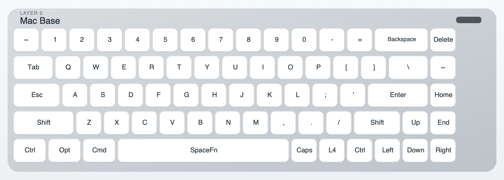
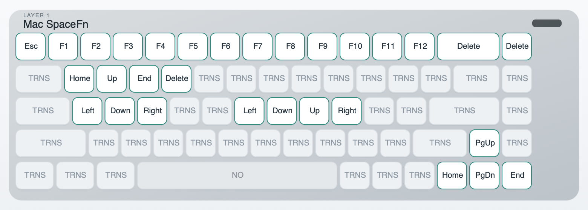
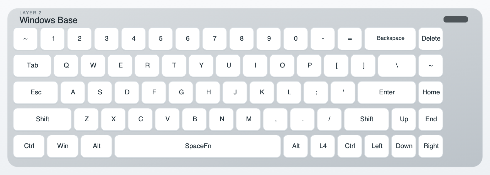
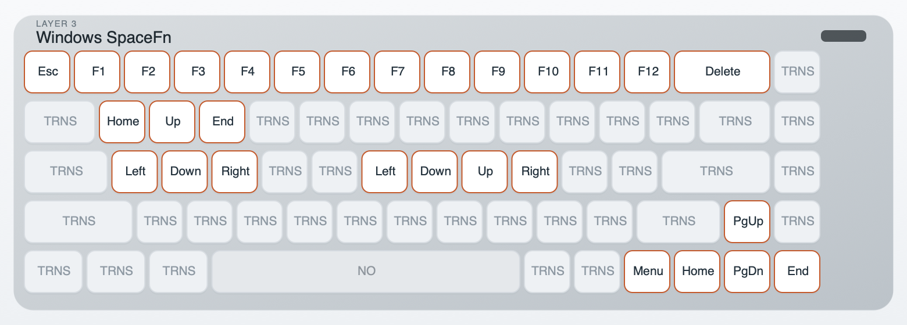
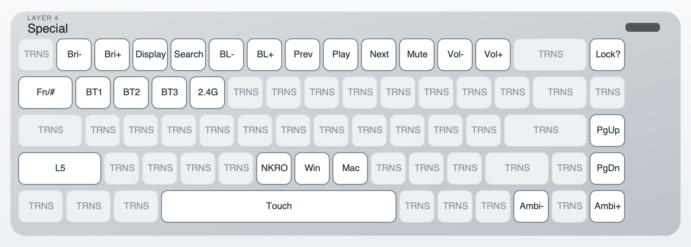

# Lofree Flow / Flow2 SpaceFn

Custom layouts, patched vendor firmware, and tooling for the **Lofree Flow 2 68-key (`OE928`)**.

Korean README: [README.ko.md](README.ko.md)

## Start Here

If you want the simplest path, flash the ready-made firmware in [firmware/patched/oe928_v14_spacefn.hex](firmware/patched/oe928_v14_spacefn.hex).

This is the recommended path because it keeps the Flow 2 wireless switching keys working without relying on VIA `Save + Load`.

## What You Get

This firmware gives you a SpaceFn-based keymap with the vendor wireless switching keys preserved.

- tap `Space`: normal space
- hold `Space`: temporary Fn layer
- `Fn + W A S D`: arrows
- `Fn + H J K L`: arrows
- `Fn + Q / E`: `Home / End`
- `Fn + 1..=`: `F1..F12`
- `Layer 4 + N / M`: Windows / Mac switching
- physical arrow cluster: `Home / Page Down / Page Up / End`
- BT1 / BT2 / BT3 / 2.4G switching kept on the special layer

See [docs/keymaps/flow2_lofree_spacefn_keymap.md](docs/keymaps/flow2_lofree_spacefn_keymap.md) for the full layer map.

## Layer Gallery

Quick visual reference for the five main layers. Full page version: [docs/keymaps/flow2_lofree_spacefn_layers.md](docs/keymaps/flow2_lofree_spacefn_layers.md)

<table>
  <tr>
    <td width="50%">
      <strong>Layer 0 · Mac Base</strong><br>
      
    </td>
    <td width="50%">
      <strong>Layer 1 · Mac SpaceFn</strong><br>
      
    </td>
  </tr>
  <tr>
    <td width="50%">
      <strong>Layer 2 · Windows Base</strong><br>
      
    </td>
    <td width="50%">
      <strong>Layer 3 · Windows SpaceFn</strong><br>
      
    </td>
  </tr>
  <tr>
    <td colspan="2">
      <strong>Layer 4 · Special</strong><br>
      
    </td>
  </tr>
</table>

## What You Need

- a **Lofree Flow 2 68-key (`OE928`)**
- a USB cable
- [QMK Toolbox](https://github.com/qmk/qmk_toolbox/releases) for flashing
- optional: [VIA](https://usevia.app/) for inspecting or adjusting the layout after flashing
- this firmware file: [firmware/patched/oe928_v14_spacefn.hex](firmware/patched/oe928_v14_spacefn.hex)

Helpful references:

- [QMK flashing guide](https://docs.qmk.fm/newbs_flashing)
- [QMK bootloader / flashing docs](https://docs.qmk.fm/flashing)
- vendor flashing video in this repo: [references/flow2_upgrade_instructions.mp4](references/flow2_upgrade_instructions.mp4)

## Flash the Firmware

1. Install [QMK Toolbox](https://github.com/qmk/qmk_toolbox/releases).
2. Open QMK Toolbox and load [firmware/patched/oe928_v14_spacefn.hex](firmware/patched/oe928_v14_spacefn.hex).
3. Put the keyboard into DFU mode. If you are unsure how, watch [references/flow2_upgrade_instructions.mp4](references/flow2_upgrade_instructions.mp4).
4. Click `Flash` in QMK Toolbox and wait for it to finish.
5. Reboot the keyboard.
6. Test `SpaceFn`, the arrow layers, `Layer 4 + N / M`, and the BT1 / BT2 / BT3 / 2.4G switching keys.
7. `[Optional, but often necessary]` Clear EEPROM if the keyboard still behaves like the old layout or does not pick up the new embedded default keymap.

Full walkthrough: [docs/guides/flash_patched_firmware.md](docs/guides/flash_patched_firmware.md)

## Roll Back to Vendor Firmware

If you want to undo the SpaceFn firmware, flash [references/oe928_v14_vendor.hex](references/oe928_v14_vendor.hex) with the same QMK Toolbox workflow.

## If You Want to Stay on Vendor Firmware

You can still use VIA only:

- load [layouts/spacefn/flow2_lofree_spacefn.layout.json](layouts/spacefn/flow2_lofree_spacefn.layout.json)
- read the caveats in [docs/guides/via_layouts.md](docs/guides/via_layouts.md)

This is less reliable than the patched firmware because Flow 2 wireless switching keys can become `KC_NO` after a VIA `Save + Load` round-trip.

## What This Repo Provides

- a working **SpaceFn** layout for the Flow 2 68-key
- the original VIA layout backup used in this repo
- a patched vendor firmware image that preserves the working BT/2.4G switching keys
- a small tool to extract or patch the embedded default keymap inside the vendor firmware
- documentation for the VIA limitation that turns some Flow 2 wireless-switching keys into `KC_NO`

## Why SpaceFn

The layout is built around one idea:

- tap `Space`: normal space
- hold `Space`: temporary Fn layer

The SpaceFn layers provide:

- `Fn + W A S D`: arrows
- `Fn + H J K L`: arrows
- `Fn + Q / E`: `Home / End`
- `Fn + 1..=`: `F1..F12`
- physical arrow cluster: `Home / Page Down / Page Up / End`
- a dedicated special layer for wireless switching, media, volume, brightness, backlight, search, and ambient light

## Repository Map

- [layouts/original/flow2_lofree.layout.json](layouts/original/flow2_lofree.layout.json): repo backup of the original VIA layout
- [layouts/spacefn/flow2_lofree_spacefn.layout.json](layouts/spacefn/flow2_lofree_spacefn.layout.json): main SpaceFn VIA layout
- [layouts/README.md](layouts/README.md): notes about layout sources and caveats
- [firmware/patched/oe928_v14_spacefn.hex](firmware/patched/oe928_v14_spacefn.hex): ready-to-flash patched vendor firmware
- [firmware/extracted/oe928_v14_factory.layout.json](firmware/extracted/oe928_v14_factory.layout.json): default layout extracted from the vendor `v14` firmware
- [tools/oe928_firmware_tool.py](tools/oe928_firmware_tool.py): firmware extract/patch tool
- [docs/README.md](docs/README.md): documentation index
- [references/README.md](references/README.md): vendor files and reverse-engineering references

## Important Notes

- The Flow 2 68-key uses vendor-specific handling for some wireless-switching keys.
- VIA layout JSON alone is not always enough to preserve those keys.
- [layouts/original/flow2_lofree.layout.json](layouts/original/flow2_lofree.layout.json) is a useful repo backup, but it is not a byte-for-byte dump of the embedded default layout from vendor firmware `v14`.

## Tooling

The included tool supports:

- dump the embedded default keymap
- decode that keymap into VIA/QMK-style tokens
- extract it to a VIA layout JSON
- patch a VIA layout JSON back into the vendor firmware image

Common commands:

```bash
make dump
make extract
make patch
```

## Documentation

- [docs/README.md](docs/README.md)
- [docs/guides/flash_patched_firmware.md](docs/guides/flash_patched_firmware.md)
- [docs/guides/via_layouts.md](docs/guides/via_layouts.md)
- [docs/firmware/flow2_firmware_notes.md](docs/firmware/flow2_firmware_notes.md)
- [docs/keymaps/flow2_lofree_spacefn_keymap.md](docs/keymaps/flow2_lofree_spacefn_keymap.md)
